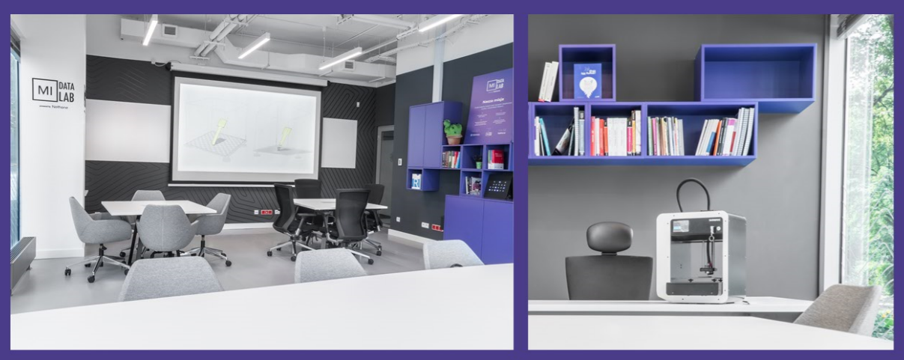

========================================================
author: ALeksandra Dąbrowska, Alicja Gosiewska
date:
width: 1400
height: 900
css: custom.css

Grupa MI^2 i MI^2 DataLab
========================================================


NCN Opus grant 2016/21/B/ST6/02176
========================================================

======================================================


======================================================


======================================================


======================================================


======================================================


Podstawowe  pojęcia
======================================================

- Gen
- Sonda CpG
- Ekspresja genu
- Metylacja DNA


Ekspresja
======================================================


```
                             SUBTYPE AANAT AARSD1 AATF AATK
TCGA-A1-A0SB-01A-11R-A144-07  Normal     9   2354 2870  317
TCGA-A1-A0SD-01A-11R-A115-07    LumA     2   1846 5656  312
TCGA-A1-A0SE-01A-11R-A084-07    LumA    11   3391 9522  736
TCGA-A1-A0SF-01A-11R-A144-07    LumA     0   2169 4625  169
TCGA-A1-A0SG-01A-11R-A144-07    LumA     1   2273 3473   92
```


```
     id log2.fold         pval mean_LumA mean_other     mean
1 AURKB  2.339920 3.191000e-32  539.0426  2323.8868  1485.01
2  CBX2  2.895062 2.834335e-26  632.5106  4296.6038  2574.48
3 KPNA2  1.447288 8.551812e-24  11547.36   26427.38 19433.77
4 PRR11  3.822148 2.286874e-22   396.383   3479.981  2030.69
5 BIRC5  1.988998 1.953941e-21  1957.085   6658.358  4448.76
6  GSG2  1.405039 3.527773e-21  278.2128   629.3396   464.31
```
