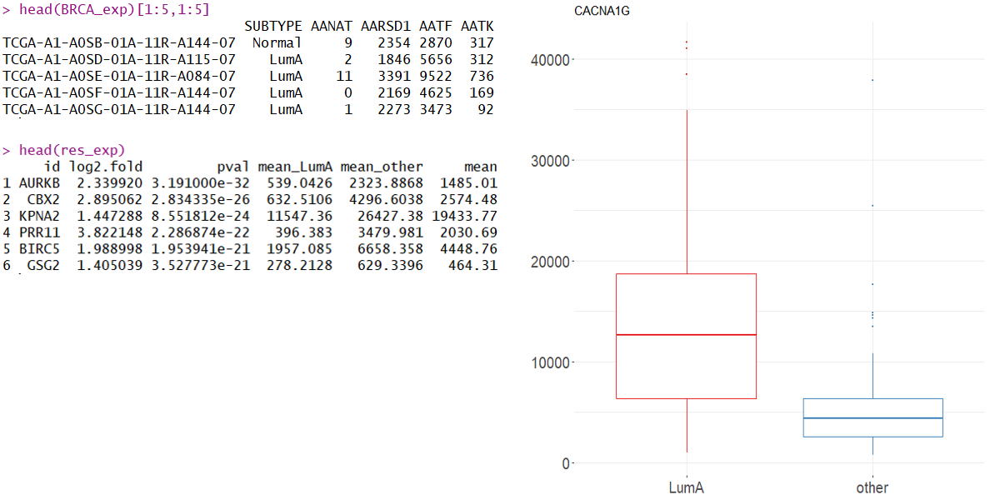
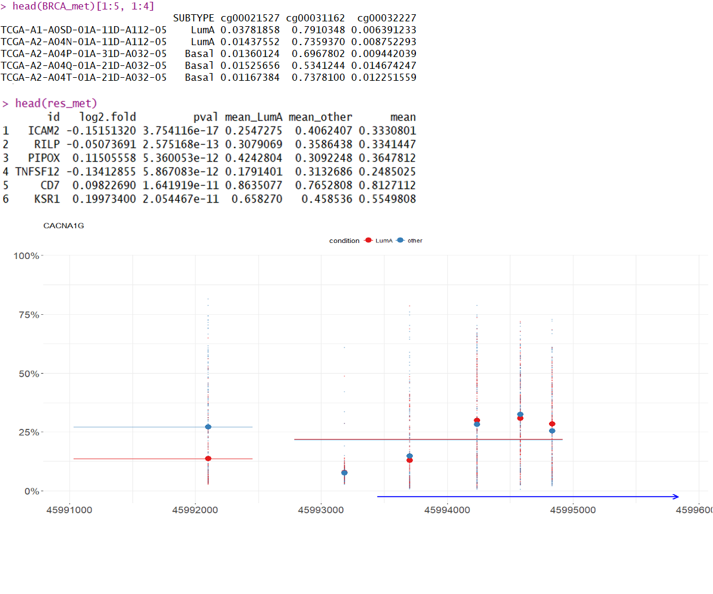

```{r, echo = FALSE, warning = FALSE}
library(knitr)
opts_chunk$set(
	comment = "",
	fig.width = 30, 
	message = FALSE,
	warning = FALSE,
	tidy.opts = list(
		keep.blank.line = TRUE,	
		width.cutoff = 500
		),
	options(width = 500),
	eval = TRUE
)
```
  
```{r, echo = FALSE}
library(MLExpResso)
library(MLExpRessoData)
load("data_pres.Rda")
```  
  
# Grupa MI<sup>2</sup> i MI<sup>2</sup> DataLab {data-background="img/MI2.PNG"}
  
# NCN Opus grant 2016/21/B/ST6/02176

# Nazwa
## {data-background="prezentacje_biala_fioletowa/Slajd8.PNG"}
## {data-background="prezentacje_biala_fioletowa/Slajd9.PNG"}
## {data-background="prezentacje_biala_fioletowa/Slajd10.PNG"}
## {data-background="prezentacje_biala_fioletowa/Slajd11.PNG"}
## {data-background="prezentacje_biala_fioletowa/Slajd12.PNG"}

#Terminologia biologiczna

##Podstawowe  pojęcia {data-background="img/DNA3.PNG"}
- Gen 
- Sonda CpG
- Ekspresja genu
- Metylacja DNA

#Wywołania funkcji


##Ekspresja


##Metylacja


##Integracja ekspresji i metylacji


#Co dalej?

##GitHub
- https://github.com/geneticsMiNIng/MLGenSig
- https://github.com/MI2DataLab


# Wywołania funkcji

## Ekspresja


```{r}
head(BRCA_exp)[1:5,1:5]
```

```{r, eval = FALSE}
calculate_test(
  data = BRCA_exp[,!(colnames(BRCA_exp) == "SUBTYPE")], 
  condition = condition_exp, 
  test = "lrt"
)
```

```{r, echo = FALSE}
head(res_exp)
```

## Volcano plot

```{r}
plot_volcano(res_exp, line = 0.05, names = 0.000000001, fold_line = 2)
```

## Metylacja

```{r}
BRCA_met[1:5, 1:4]
```

```{r}
BRCA_met_gen <- aggregate_probes(data = BRCA_met) 
BRCA_met_gen[1:5, 1:4]
```

## Methylation path
