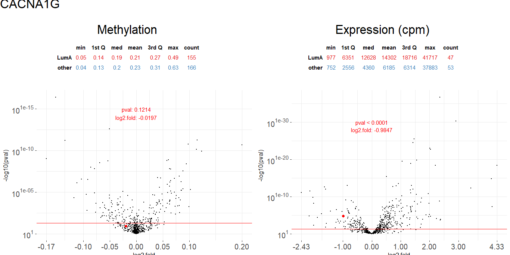
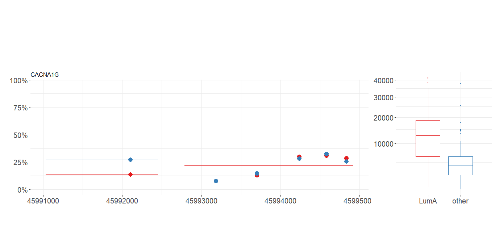

```{r, echo = FALSE, warning = FALSE}
library(knitr)
opts_chunk$set(
	comment = "",
	fig.width = 30, 
	message = FALSE,
	warning = FALSE,
	tidy.opts = list(
		keep.blank.line = TRUE,	
		width.cutoff = 500
		),
	options(width = 500),
	eval = TRUE
)
```
  
```{r, echo = FALSE}
library(MLExpResso)
library(MLExpRessoData)
load("data_pres.Rda")
```  
  
# Grupa MI<sup>2</sup> i MI<sup>2</sup> DataLab {data-background="img/MI2_z_logiem.PNG"}
  
# "MLGenSig:                  Machine Learning Methods for building the Integrated Genetic Signatures"                               NCN Opus grant 2016/21/B/ST6/02176

# Nazwa
## {data-background="prezentacje_biala_fioletowa/Slajd8.PNG"}
## {data-background="prezentacje_biala_fioletowa/Slajd9.PNG"}
## {data-background="prezentacje_biala_fioletowa/Slajd10.PNG"}
## {data-background="prezentacje_biala_fioletowa/Slajd11.PNG"}
## {data-background="prezentacje_biala_fioletowa/Slajd12.PNG"}

#Terminologia biologiczna

##Podstawowe  pojęcia {data-background="img/DNA3.PNG"}
- Gen 
- Sonda CpG
- Ekspresja genu
- Metylacja DNA


# Ekspresja

## Testowanie

```{r}
BRCA_exp[1:5,1:5]
```

```{r, eval = FALSE}
calculate_test(
  data = BRCA_exp[,!(colnames(BRCA_exp) == "SUBTYPE")], 
  condition = condition_exp, 
  test = "lrt"
)
```

```{r, echo = FALSE}
head(res_exp)
```

## Volcano plot

```{r, echo=FALSE, eval=FALSE}
plot_volcano(data = res_exp, line = 0.05, names = 0.000000001, fold_line = 2)
```

```{r, eval= FALSE}
plot_volcano(data, line, names, fold_line)
```


# Metylacja

## Agregacja sond do genów
```{r}
BRCA_met[1:5, 1:4]
```

```{r}
BRCA_met_gen <- aggregate_probes(data = BRCA_met) 
BRCA_met_gen[1:5, 1:4]
```

## Methylation path

```{r, eval=FALSE, echo=FALSE}
plot_methylation_path(
  data = BRCA_met, 
  condition = condition_met, 
  gene = 'CACNA1G', 
  show.gene = TRUE, 
  observ = TRUE
)
```

```{r,eval=FALSE}
plot_methylation_path(data, condition, gene, show.gene, observ)
```


## Testowanie
```{r, eval = FALSE}
calculate_test(
  data = BRCA_met_gen, 
  condition = condition_met,
  test = "ttest"
)
```

```{r, echo = FALSE}
head(res_met)[1:5, 1:5]
```

# Integracja ekspresji i metylacji

## Tabela porównań

```{r, eval = FALSE}
comparison <- calculate_comparison_table(
  data1 = BRCA_exp[,!(colnames(BRCA_exp)=="SUBTYPE")], 
  data2 = BRCA_met_gen, 
  condition1 = condition_exp, 
  condition2 = condition_met,
  test1 = "nbinom2", 
  test2 = "ttest"
)
```

```{r, echo = TRUE}
head(comparison)
```

## Volcano plots

```{r, eval=FALSE}
plot_volcanoes(data.m, data.e, 
               condition.m, condition.e, 
               gene, test.m, test.e)
```

```{r, eval=FALSE, echo=FALSE}
plot_volcanoes(
  data.m = BRCA_met[,!(colnames(BRCA_met) == "SUBTYPE")],
  data.e = BRCA_exp[,!(colnames(BRCA_exp) == "SUBTYPE")],
  condition.m = condition_met, 
  condition.e = condition_exp, 
  gene = "CACNA1G", 
  test.m = test_met, 
  test.e = test_exp,
  values=TRUE
)
```



## Informacje dla wybranego genu

```{r, eval=FALSE, echo=FALSE}
plot_gene(
  data.m = BRCA_met, 
  data.e = BRCA_exp, 
  condition.m = condition_met, 
  condition.e = condition_exp, 
  gene = "CACNA1G",
  show.gene = TRUE,
  observ = TRUE,
  islands = TRUE
)
```

```{r, eval=FALSE}
plot_gene(data.m, data.e, 
               condition.m, condition.e, 
               gene, show.gene, observ, islands)
```



##{data-background="img/pomoce.PNG"}


#Co dalej?

##GitHub

- https://github.com/geneticsMiNIng/MLGenSig
- https://github.com/MI2DataLab
